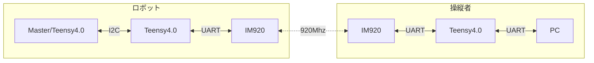
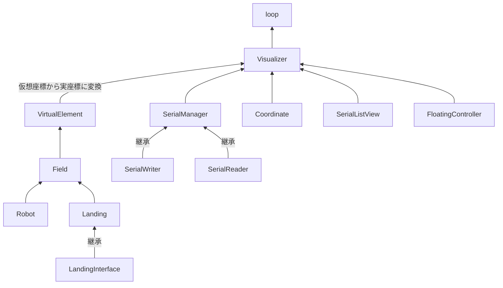

# Visualizer

ロボットの発射機構操縦、現在位置表示アプリ

## 🤔 Description

ロボットに搭載されている左右の発射機構の操縦アプリです。

2022 年度 四国地区、全国高専ロボコンで使用しました。

## 🐣 Download

[Windows x64](https://github.com/CaseyNelson314/Visualizer/releases/download/v1.0.1/Visualizer.exe)

## 💬 Usage

### キー操作(デバッグ用)

ロボットをキーボードで動かします。WASD キーで平行移動、QE キーで旋回できます。

### 着陸点選択

着陸点 (スポット、ベース、滑走路) をタッチすることで選択できます。最大 2 箇所まで選択できます(機構の都合上)。

### 発射機構切り替え

ロボットをタッチすることで使用する発射機構の切り替えができます。

### スタートゾーン切替

スタートゾーンをタッチすることで切り替えられます。

### 浮動コントローラー

ロボットへ発射機構の微調整、発射、ゼロ点取り、射出ローラー回転切替、再装填の指示を送信します。

ドラッグすると画面上を自由に移動できます。

### 通信

右上の COM ポートリストからポートを選択後、OPEN ボタンを押すことで通信を開始します。

※Bluetooth 経由の COM ポートを開こうとした時、アプリが落ちる場合があります。

### その他

F キーを押すことでフルスクリーンモードに切り替えられます。

F1 キーを押すことで OpenSiv3D が使用しているサードパーティ・ソフトウェアのライセンス情報を表示します。

## 📗 Summary

### 通信

PC とロボット間の通信の流れは以下のようになっています。

各データがまとまった構造体をバイト列に変換し送受信しています。

### GUI

描画用フレームワークである OpenSiv3D を使い、C++で記述しています。

使わせていただいた OpenSiv3D のリンクです。

<https://siv3d.github.io/ja-jp/>

<https://github.com/Siv3D/OpenSiv3D>

### Class Tree

このアプリはクラスの組み合わせによって構成されています。

| クラス名           | 役割                       |
| ------------------ | -------------------------- |
| Field              | 競技フィールドエリア       |
| Landing            | 着陸点                     |
| FloatingController | 浮動コントローラー         |
| SerialListView     | シリアルポートリスト(右上) |
| Coordinate         | 座標表示 (右下)            |
| SerialManager      | 通信管理                   |

## 👤 Author

[CaseyNelson](https://github.com/CaseyNelson314)

## 📖 License

MIT License

## 💻 Development

|     |                                                       |
| :-: | ----------------------------------------------------- |
| OS  | Windows 11 Home, Pro                                  |
| IDE | Microsoft Visual Studio Community 2022 Version 17.4.4 |
| SDK | OpenSiv3D v0.6.6                                      |
